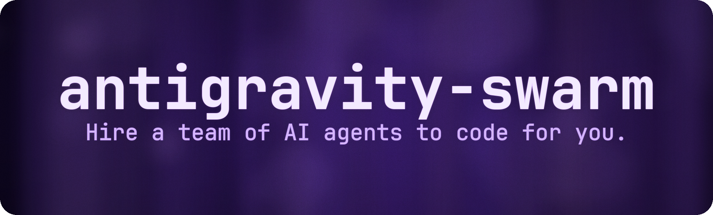

<p align="center">
  
</p>

<h1 align="center">Antigravity Swarm</h1>
<p align="center">
  <em>Gemini CLI와 Antigravity IDE에서 AI 코딩 에이전트 팀을 오케스트레이션하세요.</em>
</p>
<p align="center">
  <a href="#quick-start">빠른 시작</a> ·
  <a href="#why-antigravity-swarm">왜 Antigravity Swarm인가</a> ·
  <a href="#usage">사용 방법</a> ·
  <a href="#protocol--architecture">아키텍처</a> ·
  <a href="./README.md">English</a>
</p>
<p align="center">
  
  
  
  
</p>

Antigravity Swarm은 단일 에이전트 흐름을 협업형 AI 코딩 팀으로 확장하는 스킬입니다. `planner.py`로 팀을 설계하고, `orchestrator.py`로 실시간 실행을 관리하며, `Quality_Validator`로 마지막 검증을 닫습니다.

## Antigravity Swarm 한눈에 보기

```text
┏━━━━━━━━━━━━━━━━━━━━━━━━━━━━━━━━━━━━━━━━━━━━━━━━━━━━━━━━━━━━━━━━━━━━━━━━━━━━━━┓
┃                   Antigravity Swarm Mission Control                        ┃
┗━━━━━━━━━━━━━━━━━━━━━━━━━━━━━━━━━━━━━━━━━━━━━━━━━━━━━━━━━━━━━━━━━━━━━━━━━━━━━━┛
┌──────────────┬──────────┬──────────────┬───────┬─────────┬─────────────────────┐
│ Agent        │ Role     │ Status       │ Time  │ Msgs    │ Backend             │
├──────────────┼──────────┼──────────────┼───────┼─────────┼─────────────────────┤
│ ● Oracle     │ parallel │ Running      │ 12.3s │ ↑2 ↓1   │ tmux %3             │
│ ● Junior     │ parallel │ Running      │ 10.1s │ ↑0 ↓1   │ tmux %4             │
│ ● Librarian  │ serial   │ Pending      │ -     │ -       │ -                   │
│ ● Validator  │ validator│ Pending      │ -     │ -       │ -                   │
└──────────────┴──────────┴──────────────┴───────┴─────────┴─────────────────────┘
┌─── Live Activity ──────────────────────────────────────────────────────────────┐
│ Oracle: Analyzing auth.py module structure...                                  │
└────────────────────────────────────────────────────────────────────────────────┘
[Tab] View  [w,s] Select  [k] Kill  [x] Shutdown  [q] Quit
```

> [!IMPORTANT]
> Gemini 기반 워크플로가 단일 에이전트에서 멈춘다면, Antigravity Swarm이 그 위에 팀 조율 계층을 얹습니다. 팀 구성, 실시간 오케스트레이션, 메일박스 기반 협업, 재개 가능한 미션, 마지막 검증가까지 한 흐름으로 제공합니다.

<a id="quick-start"></a>
## 빠른 시작

가장 빠른 첫 실행 경로는 아래와 같습니다.

1. Python 의존성을 설치하고 Gemini CLI를 확인합니다.

   ```bash
   pip install -r requirements.txt
   gemini --version
   ```

2. 기본 팀과 미션 파일을 생성합니다.

   ```bash
   python3 scripts/planner.py --preset quick "모든 Python 모듈에 단위 테스트 작성"
   ```

3. 오케스트레이터를 실행합니다.

   ```bash
   python3 scripts/orchestrator.py --yes
   ```

가장 최근 미션 재개:

```bash
python3 scripts/orchestrator.py --resume
```

Gemini CLI 없이 TUI만 확인:

```bash
python3 scripts/orchestrator.py --demo
```

> [!TIP]
> Planner는 미션 작업 디렉토리에 `subagents.yaml`, `task_plan.md`, `findings.md`, `progress.md`, 그리고 `.swarm/` 런타임 상태를 생성합니다.

<a id="why-antigravity-swarm"></a>
## 왜 Antigravity Swarm인가

- **병렬 실행**: 긴 단일 루프 대신 여러 에이전트를 동시에 돌릴 수 있습니다.
- **역할 분리**: 아키텍처, 탐색, 구현, 비평, 문서화를 서로 다른 에이전트에 맡길 수 있습니다.
- **내장 검증**: 모든 팀은 `Quality_Validator`로 종료되어 완료 주장 전에 검증 단계를 거칩니다.
- **실시간 협업**: 파일 기반 메일박스로 에이전트 간 메시지를 주고받고, 오케스트레이터에서 그 흐름을 바로 볼 수 있습니다.
- **미션 지속성**: 중단된 실행을 재개하고, 감사 로그와 진행 흔적을 남길 수 있습니다.

핵심은 에이전트 수를 늘리는 데 있지 않습니다. 계획, 실행, 통신, 검증을 분리해 보이는 상태로 관리하는 데 있습니다.

## v2 핵심 기능

Antigravity Swarm은 단순 배치 실행기에서 실시간 에이전트 팀 플랫폼으로 확장되었습니다.

- **에이전트 간 메시징**: `<<SEND_MESSAGE ...>>`, `<<BROADCAST>>` 태그를 통해 JSON 메일박스로 통신합니다.
- **에이전트 라이프사이클 관리**: `PENDING -> RUNNING -> IDLE -> RUNNING -> COMPLETED/FAILED/SHUTDOWN`
- **인터랙티브 TUI v2**: Dashboard, Messages, Agent Detail 3개 뷰를 키보드로 탐색합니다.
- **백엔드 추상화**: 기본은 thread, 가능하면 tmux pane 기반 실행을 사용합니다.
- **감사 추적**: `.swarm/audit/` 아래에 append-only JSONL 로그를 남깁니다.
- **미션 영속화**: `--resume`으로 중단된 실행을 이어갈 수 있습니다.
- **팀 프리셋**: `swarm-config.yaml`로 재사용 가능한 팀 구성을 정의합니다.
- **미션 종료 리포트**: 에이전트별 통계와 최근 타임라인을 요약합니다.
- **스트리밍 사이드 이펙트 파싱**: 태그를 응답 종료 후가 아니라 출력 도중 즉시 실행합니다.
- **하트비트 모니터링**: 멈추거나 죽은 에이전트를 자동 감지합니다.

## 사전 요구사항

설치 전에 아래 항목이 준비되어 있어야 합니다.

| 요구사항 | 설치 명령어 | 비고 |
|---------|-----------|------|
| **Node.js** (v18+) | [nodejs.org](https://nodejs.org) | Gemini CLI에 필요 |
| **Gemini CLI** | `npm install -g @google/gemini-cli` | 에이전트가 사용하는 핵심 런타임 |
| **Python 3.8+** | [python.org](https://python.org) | Planner/Orchestrator 스크립트 런타임 |
| **pip 패키지** | `pip install -r requirements.txt` | `rich`, `pyyaml` 설치 |

> [!TIP]
> Gemini CLI가 없다면 Planner가 첫 실행 시 설치 흐름을 제안할 수 있습니다.

## 설치

> [!TIP]
> 아래 블록을 그대로 LLM 에이전트에게 전달하면 설치부터 검증까지 한 번에 수행할 수 있습니다.

```text
이 저장소를 설치부터 검증까지 end-to-end로 수행하세요.

리포지토리: https://github.com/wjgoarxiv/antigravity-swarm
설치 경로: <your-install-path>/antigravity-swarm

작업 순서:
1) 위 경로에 clone 수행 (이미 있으면 reset/delete하지 말고 현재 상태만 보고)
2) requirements.txt 의존성 설치
3) 런타임과 스크립트 상태 검증
   - gemini --version
   - python3 -m py_compile scripts/*.py scripts/core/*.py scripts/core/backends/*.py
   - python3 scripts/orchestrator.py --demo
4) 이 저장소에 nvim/neovim 설정 파일이 있으면 적용하고, 없으면 "no nvim config found"로 보고 후 계속 진행

안전 규칙:
- 첫 실패 지점에서 즉시 중단하고 실패 명령과 이유를 정확히 보고
- 파괴적 git 명령 금지 (reset --hard, force push, checkout --, 기존 디렉토리 삭제)

최종 보고 형식:
- Cloned: yes/no
- Dependencies: yes/no
- Validation: pass/fail
- Nvim setup: applied/skipped
- Next action: one line
```

### 수동 설치

1. 저장소를 clone한 뒤 디렉토리로 이동합니다.

   ```bash
   git clone https://github.com/wjgoarxiv/antigravity-swarm.git
   cd antigravity-swarm
   ```

2. Gemini skills 디렉토리에 연결하거나 복사합니다.

   ```bash
   mkdir -p ~/.gemini/skills
   ln -s "$(pwd)" ~/.gemini/skills/antigravity-swarm
   ```

3. Python 의존성을 설치합니다.

   ```bash
   pip install -r requirements.txt
   ```

4. `gemini` 명령이 `PATH`에서 보이는지 확인하고, 필요하면 `swarm-config.yaml`에서 프리셋이나 백엔드 설정을 조정합니다.

### 에이전트 원샷 프롬프트 (업데이트/업그레이드)

```text
재설치 없이 이 저장소를 안전하게 업데이트하고 다시 검증하세요.

저장소 경로: <your-install-path>/antigravity-swarm

작업 순서:
1) 현재 git status와 branch 확인
2) 최신 변경사항을 안전하게 pull (파괴적 명령 금지)
3) requirements.txt가 바뀐 경우에만 Python 의존성 갱신
4) 검증 실행
   - gemini --version
   - python3 -m py_compile scripts/*.py scripts/core/*.py scripts/core/backends/*.py
   - python3 scripts/orchestrator.py --demo
5) nvim/neovim 설정 파일이 있고 변경되었으면 적용/업데이트, 아니면 "no nvim update needed" 보고

안전 규칙:
- 파괴적 git 명령 금지 (reset --hard, clean -fd, force push, checkout --)
- merge/rebase 충돌이 나면 즉시 중단하고 충돌 파일 목록 보고

최종 보고 형식:
- Pulled: yes/no
- Dependency refresh: yes/no
- Validation: pass/fail
- Nvim update: applied/skipped
- Next action: one line
```

## 운영 시 주의사항

> [!NOTE]
> **Windows 호환성**
>
> Antigravity Swarm은 PowerShell과 한국어 로케일 환경을 고려한 Windows 처리 경로를 포함합니다. 가능한 경우 UTF-8 출력을 강제하고, Windows에서는 `msvcrt`, macOS/Linux에서는 `termios`/`tty` 기반 키보드 입력을 사용합니다.

> [!WARNING]
> **오케스트레이터 실행 중에는 런타임 상태를 수동 수정하지 마세요.**
>
> 시스템은 `task_plan.md`, `findings.md`, `progress.md`, `subagents.yaml`, 그리고 `.swarm/` 디렉토리를 실시간으로 읽고 씁니다. 실행 중 수동 편집은 race condition이나 상태 불일치를 만들 수 있습니다.

> [!NOTE]
> **상태 파일은 워크플로의 일부입니다**
>
> 미션이 시작되면 공유 메모리 파일과 `.swarm/` 런타임 상태가 생성됩니다. 실행이 끝나기 전까지는 임시 파일이 아니라 협업 아티팩트로 취급하는 것이 안전합니다.

<a id="usage"></a>
## 사용 방법

원하는 작업 방식에 맞는 경로를 고르면 됩니다.

### 경로 A: Gemini CLI

커스텀 팀 계획:

```bash
python3 scripts/planner.py "미션 내용"
python3 scripts/orchestrator.py --yes
```

프리셋 기반 시작:

```bash
python3 scripts/planner.py --preset quick "미션 내용"
python3 scripts/orchestrator.py --yes
```

재개:

```bash
python3 scripts/orchestrator.py --resume
```

데모:

```bash
python3 scripts/orchestrator.py --demo
```

### 경로 B: 자율 루프

```bash
python3 scripts/ultrawork_loop.py "미션 내용"
```

재개:

```bash
python3 scripts/ultrawork_loop.py --resume
```

`ultrawork_loop.py`는 실패 시 최대 5번까지 다시 계획하고 재실행합니다.

### 경로 C: Antigravity IDE

`~/.gemini/GEMINI.md`에 이 스킬을 연결해 두면, 큰 작업에서 메인 에이전트가 자동으로 이 워크플로를 호출할 수 있습니다.

## 예시 프롬프트

미션 문장을 어떻게 써야 할지 감이 안 오면 아래 예시를 그대로 복사해도 됩니다.

### 기본 사용

```text
antigravity-swarm 스킬을 이용해서 이 프로젝트에 대한 단위 테스트를 작성해줘.
```

```text
antigravity-swarm 스킬을 이용해서 이 프로젝트의 인증 모듈을 리팩토링해줘.
```

### 고급 사용

```text
antigravity-swarm 스킬의 fullstack 프리셋을 이용해서 React 기반 Todo 앱을 만들어줘.
```

```text
antigravity-swarm 스킬의 analysis 프리셋을 이용해서 코드베이스 아키텍처를 분석하고 문서를 만들어줘.
```

### CLI 직접 사용

```bash
# 작은 작업을 빠르게 처리
python3 scripts/planner.py --preset quick "모든 Python 모듈에 단위 테스트 작성"
python3 scripts/orchestrator.py --yes

# 풀스택 팀으로 넓은 범위 작업 실행
python3 scripts/planner.py --preset fullstack "인증이 포함된 REST API 구축"
python3 scripts/orchestrator.py --yes

# 분석 중심 팀으로 위험과 구조 검토
python3 scripts/planner.py --preset analysis "아키텍처를 검토하고 리스크를 정리해줘"
python3 scripts/orchestrator.py --yes
```

> [!TIP]
> IDE 에이전트에서는 `antigravity-swarm 스킬을 이용해서 ...` 정도의 자연어 요청만으로도 워크플로를 시작하기에 충분한 경우가 많습니다.

## 가용 에이전트 역할

Planner는 아래 풀에서 2-5명의 전문가를 고르고, 마지막에는 항상 `Quality_Validator`를 배치합니다.

| 역할 | 전문 분야 | 기본 모델 |
|------|-----------|-----------|
| **Oracle** | 아키텍처, 심층 디버깅, 근본 원인 분석 | `auto-gemini-3` |
| **Librarian** | 문서 탐색, 코드 구조 분석, 리서치 | `auto-gemini-3` |
| **Explore** | 빠른 파일 검색, 패턴 매칭, 정찰 | `auto-gemini-3` |
| **Frontend** | UI 컴포넌트, 스타일링, 접근성, 프론트엔드 로직 | `auto-gemini-3` |
| **Doc_Writer** | README, API 문서, 주석 | `auto-gemini-3` |
| **Prometheus** | 전략 기획, 요구사항 수집 | `auto-gemini-3` |
| **Momus** | 비판적 검토, 실현 가능성 점검, 리스크 식별 | `auto-gemini-3` |
| **Sisyphus** | 작업 조율, 위임, 진행 추적 | `auto-gemini-3` |
| **Junior** | 직접 구현, 실행, 버그 수정 | `auto-gemini-3` |
| **Quality_Validator** | 최종 QA, 검증, 테스트 | `auto-gemini-3` |

## 설정

`swarm-config.yaml`을 수정해 런타임 동작과 팀 프리셋을 조정할 수 있습니다.

```yaml
# Antigravity Swarm Configuration
version: 1

# Spawn backend: auto | tmux | thread
backend: auto

# Default model for agents
default_model: auto-gemini-3

# Maximum parallel agents
max_parallel: 5

# Mailbox polling interval (milliseconds)
poll_interval_ms: 1000

# Permission mode: auto | ask | deny
permission_mode: auto

# Audit trail
audit_enabled: true

# TUI refresh rate (frames per second)
tui_refresh_rate: 10

# Context compaction threshold (lines before compacting)
compaction_threshold: 50

# Team presets
presets:
  fullstack:
    description: "Full-stack development team"
    agents:
      - {name: Oracle, mode: parallel}
      - {name: Frontend, mode: parallel}
      - {name: Junior, mode: parallel}
      - {name: Quality_Validator, mode: validator}
  analysis:
    description: "Deep analysis and planning team"
    agents:
      - {name: Prometheus, mode: serial}
      - {name: Momus, mode: serial}
      - {name: Librarian, mode: parallel}
      - {name: Quality_Validator, mode: validator}
  quick:
    description: "Fast single-agent execution"
    agents:
      - {name: Junior, mode: serial}
      - {name: Quality_Validator, mode: validator}
```

프리셋 사용:

```bash
python3 scripts/planner.py --preset fullstack "Todo 앱 만들어줘"
python3 scripts/planner.py --preset analysis "아키텍처 리스크를 검토해줘"
python3 scripts/planner.py --preset quick "작은 버그를 안전하게 수정해줘"
```

## 에이전트 간 통신

에이전트는 스트리밍 출력 안에 들어 있는 두 가지 메시지 태그로 통신합니다.

### 특정 에이전트에게 직접 메시지 보내기

```markdown
<<SEND_MESSAGE to="Junior">>
인증 모듈 구조를 정리했어. `src/auth/oauth.py`의 OAuth2 흐름 구현을 부탁해.
<<END_MESSAGE>>
```

### 팀 전체에 브로드캐스트 보내기

```markdown
<<BROADCAST>>
API 계약이 확정되었어. 모두 `docs/api.yml`을 기준으로 작업해줘.
<<END_BROADCAST>>
```

메시지는 `.swarm/mailboxes/`에 저장되고, 오케스트레이터의 Messages 뷰에 그대로 드러납니다.

## TUI 조작법

인터랙티브 TUI는 3가지 뷰를 키보드로 탐색할 수 있습니다.

| 키 | 기능 |
|---|---|
| **Tab** | Dashboard, Messages, Agent Detail 뷰 순환 |
| **w / s** | 선택 이동 |
| **Enter** | 선택한 에이전트 또는 메시지 열기 |
| **k** | 선택한 에이전트 종료 |
| **x** | 선택한 에이전트에 셧다운 요청 전송 |
| **q** | 오케스트레이터 종료 |
| **Esc** | Dashboard로 돌아가기 |
| **?** | 도움말 표시 |

### Dashboard View

- **Agent**: 에이전트 이름과 상태 표시
- **Role**: `parallel`, `serial`, `validator`
- **Status**: `Pending`, `Running`, `Idle`, `Completed`, `Failed`, `Shutdown`
- **Time**: 실행 시간
- **Msgs**: 송수신 메시지 수
- **Backend**: `thread` 프로세스 정보 또는 tmux pane id

### Messages View

에이전트 간 메시지를 시간순으로 보여주며, 발신자와 수신자, 미리보기 내용을 빠르게 파악할 수 있습니다.

### Agent Detail View

선택한 에이전트의 전체 출력, 상태 변화, 최근 컨텍스트를 한 화면에서 볼 수 있습니다.

<a id="protocol--architecture"></a>
## 프로토콜 및 아키텍처

### Manus Protocol

Antigravity Swarm은 영속적인 상태 관리 패턴을 따릅니다.

- **`task_plan.md`**: 미션의 마스터 체크리스트
- **`findings.md`**: 조사 내용과 발견 사항을 모으는 공유 스크래치패드
- **`progress.md`**: 완료된 작업과 현재 상태를 기록하는 로그

### 에이전트 메일박스 시스템

Manus 파일 외에도 v2에서는 JSON 기반 메일박스 계층이 추가되었습니다.

- **`.swarm/mailboxes/{agent}/inbox/`**: 아직 읽지 않은 메시지
- **`.swarm/mailboxes/{agent}/processed/`**: 처리된 메시지 보관소
- **메시지 형태**: 발신자, 수신자, 타입, 본문, 타임스탬프를 담은 JSON 레코드
- **전달 방식**: 오케스트레이터가 메일박스를 폴링하고 새 메시지를 에이전트 프롬프트에 주입

이 구조 덕분에 모든 에이전트가 같은 markdown 파일을 동시에 건드리지 않고도 동적으로 협업할 수 있습니다.

### Validator 규칙

모든 팀의 마지막 에이전트는 `Quality_Validator`여야 합니다.

- **역할**: 리뷰어이자 QA 게이트키퍼
- **임무**: `task_plan.md`를 점검하고, 산출물을 확인하고, 검증 명령을 실행해 미션 완료 여부를 실제로 확인
- **효과**: 완료 주장 전에 마지막 피드백 루프를 강제

### 에이전트 라이프사이클

에이전트는 아래 상태를 거칩니다.

1. **PENDING**: 채용되었지만 아직 시작하지 않음
2. **RUNNING**: 현재 작업 수행 중
3. **IDLE**: 추가 작업을 기다리며 메시지를 받을 수 있음
4. **COMPLETED**: 정상적으로 종료
5. **FAILED**: 복구 불가능한 오류로 중단
6. **SHUTDOWN**: 셧다운 요청을 받고 종료

오케스트레이터는 하트비트도 추적하므로 멈춘 에이전트를 자동으로 감지할 수 있습니다.

### 백엔드 추상화

실행 백엔드는 두 가지입니다.

- **Thread backend**: 기본값이며 이식성이 좋습니다. 각 에이전트는 Python thread가 추적하는 subprocess로 실행됩니다.
- **Tmux backend**: tmux가 가능하고 현재 tmux 세션 안이 아닐 때 자동 선택됩니다. 각 에이전트가 별도 pane에서 실행되어 실시간 모니터링에 유리합니다.

`swarm-config.yaml`에서 `auto`, `thread`, `tmux`를 고를 수 있습니다.

## 디렉토리 구조

### 저장소 구조

```text
antigravity-swarm/
├── scripts/
│   ├── core/
│   │   ├── __init__.py
│   │   ├── config.py
│   │   ├── types.py
│   │   ├── mailbox.py
│   │   ├── audit.py
│   │   ├── mission.py
│   │   └── backends/
│   │       ├── __init__.py
│   │       ├── base.py
│   │       ├── thread_backend.py
│   │       └── tmux_backend.py
│   ├── planner.py
│   ├── orchestrator.py
│   ├── dispatch_agent.py
│   ├── ultrawork_loop.py
│   ├── compactor.py
│   ├── reporter.py
│   └── mock_gemini_timeout.sh
├── cover.png
├── GEMINI_example.md
├── gemini-extension.json
├── requirements.txt
├── swarm-config.yaml
├── SKILL.md
├── README.md
└── README_KO.md
```

### 미션 작업 디렉토리에 생성되는 파일

미션을 실행하면 작업 디렉토리에 아래 조율 파일이 생성됩니다.

```text
your-project/
├── subagents.yaml
├── task_plan.md
├── findings.md
├── progress.md
└── .swarm/
    ├── config.json
    ├── mailboxes/
    ├── audit/
    └── missions/
```

### 런타임 상태 (`.swarm/`)

```text
.swarm/
├── config.json                  # 팀 명단과 설정 스냅샷
├── mailboxes/
│   ├── oracle/
│   │   ├── inbox/
│   │   └── processed/
│   └── junior/
│       ├── inbox/
│       └── processed/
├── audit/
│   └── mission-xyz.jsonl
└── missions/
    └── mission-xyz.json
```

## 크레딧과 영감

이 프로젝트는 **[Oh-My-Opencode](https://github.com/code-yeongyu/oh-my-opencode)**에서 큰 영감을 받았습니다.

여기서 가져온 핵심 아이디어는 다음과 같습니다.

- **멀티 에이전트 오케스트레이션**: Oracle, Librarian, Sisyphus 같은 특화 역할 구성
- **Manus Protocol**: 상태 관리를 위한 영속 markdown 파일 사용, 그리고 **[planning-with-files](https://github.com/OthmanAdi/planning-with-files)**의 영향
- **Ultrawork Loop**: 자율적으로 반복되는 `plan -> act -> verify` 흐름

이 상호작용 패턴을 정립한 원작자들에게 감사드립니다.
